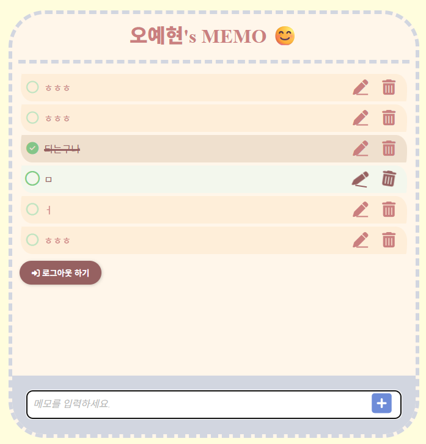
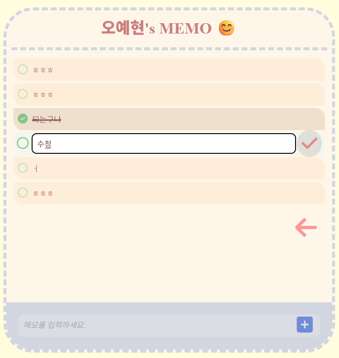
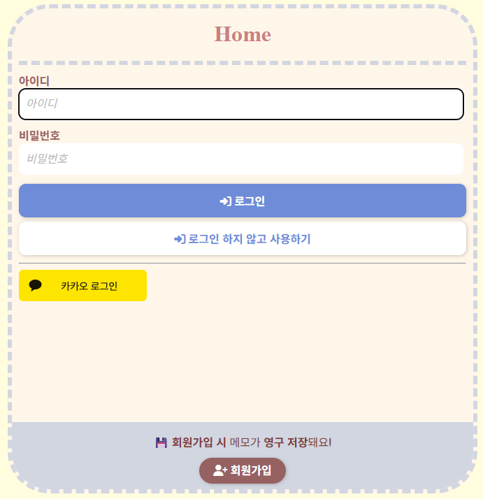
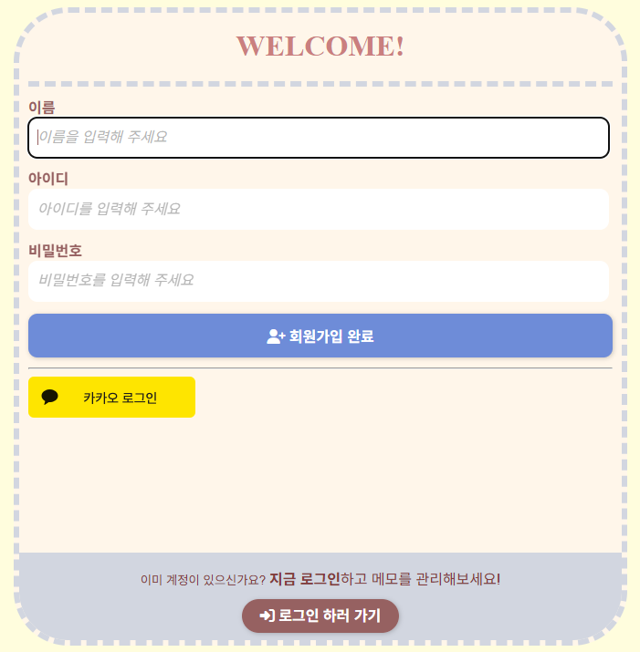

# 📝 나만의 메모장 (Memo Notepad)

`Spring Boot` 기반의 직관적인 메모장 웹 애플리케이션입니다.  
로그인 없이도 메모 작성이 가능하며, 회원가입/로그인 시에는 나만의 메모를 안전하게 저장하고 관리할 수 있습니다.

> 🚀 배포 주소: http://ec2-54-180-118-153.ap-northeast-2.compute.amazonaws.com

---

## 📌 주요 기능

### ✅ 메모 기능
- 메모 작성 / 수정 / 삭제
- 체크 여부 토글 (완료 상태 표시)
- 메모의 작성 및 수정 시간을 자동으로 저장
- 로그인 사용자 / 비로그인 사용자 각각의 메모 분리 관리

### ✅ 인증 및 회원 기능
- 로컬 회원가입 및 로그인
- `OAuth2` 소셜 로그인 (`Google`, `Kakao`)
- `JWT` 기반 인증 및 `Spring Security` 기반 인가
    - `Access Token`(5분 유효) + `Refresh Token`(20분 유효) 기반 인증 구조 구현
    - `Access Token` 만료 시 `Refresh Token`을 통해 재발급
    - `Refresh Token`은 안전하게 `Redis`에 저장되며, 로그아웃 시 삭제 처리
- 게스트 상태로 작성한 메모 → 로그인/회원가입 시 유저 계정으로 이전

### ✅ 비회원(게스트) 기능
- 로그인하지 않아도 `UUID` 기반으로 메모 작성 가능
- 세션 유지 중 자유롭게 메모 작성 및 편집 가능

### ✅ 예외 처리 및 검증
- `Bean Validation`을 통한 폼 입력 검증
- `JWT` 인증 실패 시 구체적인 에러 메시지 반환

---

## 🖥️ 화면 예시

| 메모 목록 화면                                                        | 메모 수정 화면                                                        |  
|-----------------------------------------------------------------|-----------------------------------------------------------------|
|  |  |   

|로그인 화면                                          | 회원가입 화면                                                   |
|--------|-----------------------------------------------------------|
|  |

---

## 🛠 기술 스택!

| 분야       | 기술                                                |
|------------|---------------------------------------------------|
| Language   | `Java 21`                                         |
| Framework  | `Spring Boot`, `Spring MVC`, `Spring Security`    |
| Template   | `Thymeleaf`                                       |
| DB         | `H2(개발용)`, `PostgreSQL(운영용)`                      |
| ORM        | `Spring Data JPA`, `Hibernate`                    |
| 인증/세션  | `Spring Session`, `JWT(Access + Refresh Token)` |
| 빌드 도구   | `Gradle`                                            |
| 기타       | `OAuth2`, `Lombok`, `Render(배포)`     |

---

## 📌 추가 예정 기능

- [ ] : 페이징 기능
- [ ] : 검색 기능
- [ ] : 비회원 메모 자동 삭제

---

## 👨‍💻 개발자 정보

| 이름        | 	오예현 (`Oh YeHyun`)        |
|-----------|-------------------------|
| 📧 Email	 | ohyhohyl@gmail.com      |
| 📝 Blog	  | https://tyulsjjava.tistory.com |
|  🐙 GitHub	 | https://github.com/OhYeHyun |

---

## 감사합니다! 😄
