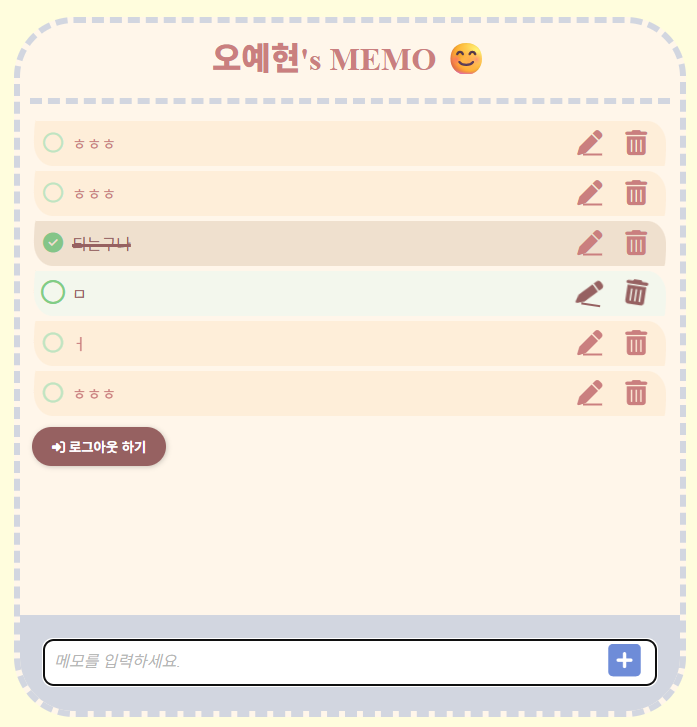
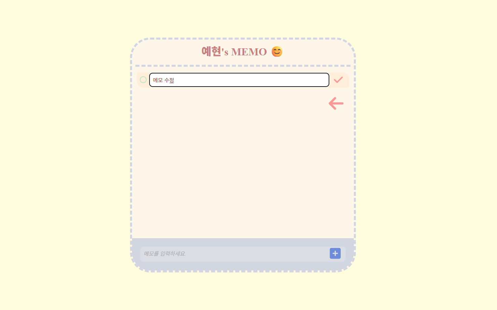
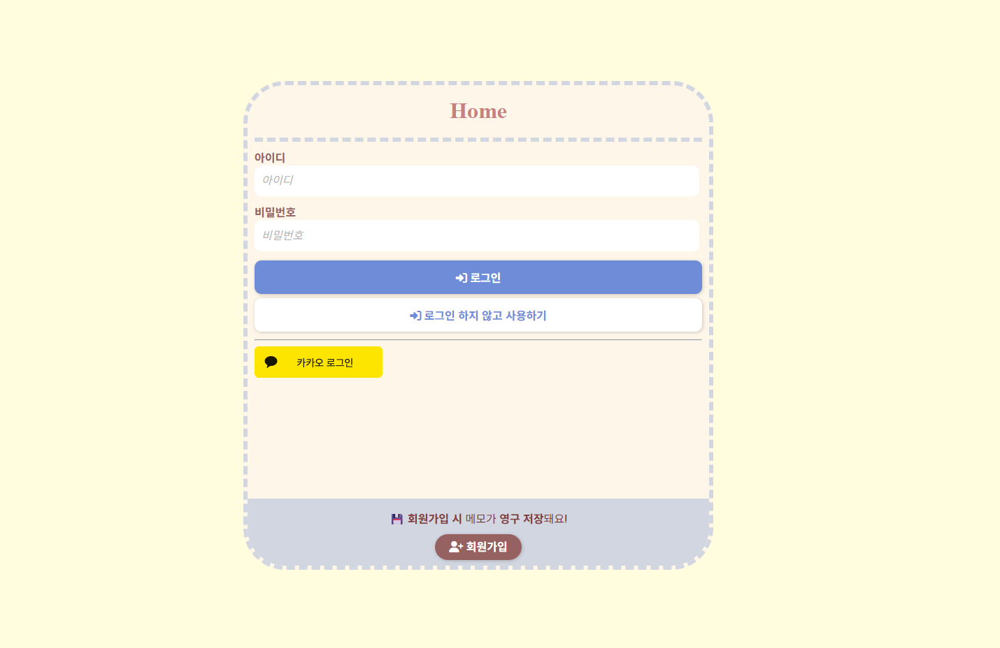
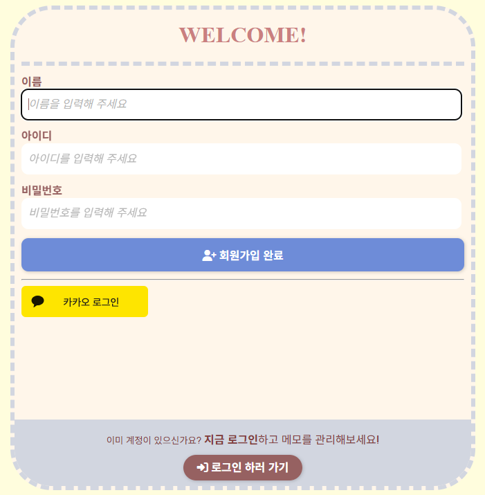

# 📝 나만의 메모장 (Memo Notepad)

Spring Boot 기반의 직관적인 메모장 웹 애플리케이션입니다.  
로그인 없이도 메모 작성이 가능하며, 회원가입/로그인 시에는 나만의 메모를 안전하게 저장하고 관리할 수 있습니다.

> 🚀 배포 주소: [https://memo-notepad.onrender.com](https://memo-notepad.onrender.com)  
> ⚠️ 최초 접속 시 약간의 로딩 시간이 발생할 수 있습니다. 잠시만 기다려주세요 😊

---

## 📌 주요 기능

### ✅ 메모 기능
- 메모 작성 / 수정 / 삭제
- 체크 여부 토글 (완료 상태 표시)
- 로그인 사용자 / 비로그인 사용자 각각의 메모 분리 관리

### ✅ 인증 및 회원 기능
- 로컬 회원가입 및 로그인
- OAuth2 소셜 로그인 (Google, Kakao)
- JWT 기반 인증 및 Spring Security 기반 인가
- 게스트 상태로 작성한 메모 → 로그인/회원가입 시 유저 계정으로 이전

### ✅ 비회원(게스트) 기능
- 로그인하지 않아도 UUID 기반으로 메모 작성 가능
- 세션 유지 중 자유롭게 메모 작성 및 편집 가능

### ✅ 예외 처리 및 검증
- Bean Validation을 통한 폼 입력 검증
- 사용자 친화적인 에러 메시지 출력
- 공통 예외 핸들러 및 로깅 처리로 디버깅 용이

---

## 🖥️ 화면 예시

| 메모 목록 화면                                                | 메모 수정 화면                                                |  
|---------------------------------------------------------|---------------------------------------------------------|
|  |  |   

|로그인 화면                                          | 회원가입 화면                                                 |
|--------|------|
|  |

---

## 🛠 기술 스택!

| 분야       | 기술                                                         |
|------------|--------------------------------------------------------------|
| Language   | Java 21                                                      |
| Framework  | Spring Boot, Spring MVC, Spring Security                     |
| Template   | Thymeleaf                                                    |
| DB         | H2 (개발용), PostgreSQL (운영용)                             |
| ORM        | Spring Data JPA, Hibernate                                   |
| 인증/세션  | Spring Session, JWT                                          |
| 빌드 도구   | Gradle                                                       |
| 기타       | OAuth2, Lombok, GitHub Actions (CI), Render (배포)           |

---

## 📁 프로젝트 구조
src  
├── config # Spring Security 및 전역 설정  
├── controller # 웹 요청 처리 (LoginController, MemoController)  
├── domain # JPA Entity (Member, Memo)  
├── dto # 요청/응답 DTO 클래스 (LoginForm, MemoSaveForm 등)  
├── repository # 데이터 접근 계층 (Spring Data JPA)  
├── security # JWT 인증/인가 관련 필터, Provider, Handlers 등  
├── service # 비즈니스 로직 (MemberService, MemoService)  
└── templates # Thymeleaf 뷰 템플릿 (memo, login, error 등) 
---

## 📌 개선 예정 기능

- [ ] 비회원 메모 세션 종료 시 자동 삭제
- [ ] 메모 고정(Pin) 기능 
- [ ] 메모 제목 필드 추가
- [ ] 체크 여부 기반 필터링
- [ ] 메모 검색 기능
- [ ] 작성/수정 시간 표시
- [ ] 삭제된 메모 복구 (소프트 딜리트)
- [ ] 페이지네이션 및 무한 스크롤
- [ ] 테스트 코드 보완 (Controller, Service 단위 테스트)

---

## 👨‍💻 개발자 정보

| 이름        | 	오예현 (Oh YeHyun)        |
|-----------|-------------------------|
| 📧 Email	 | ohyhohyl@gmail.com      |
| 📝 Blog	  | https://tyulsjjava.tistory.com |
|  🐙 GitHub	 | https://github.com/OhYeHyun |

---

## 감사합니다! 😄