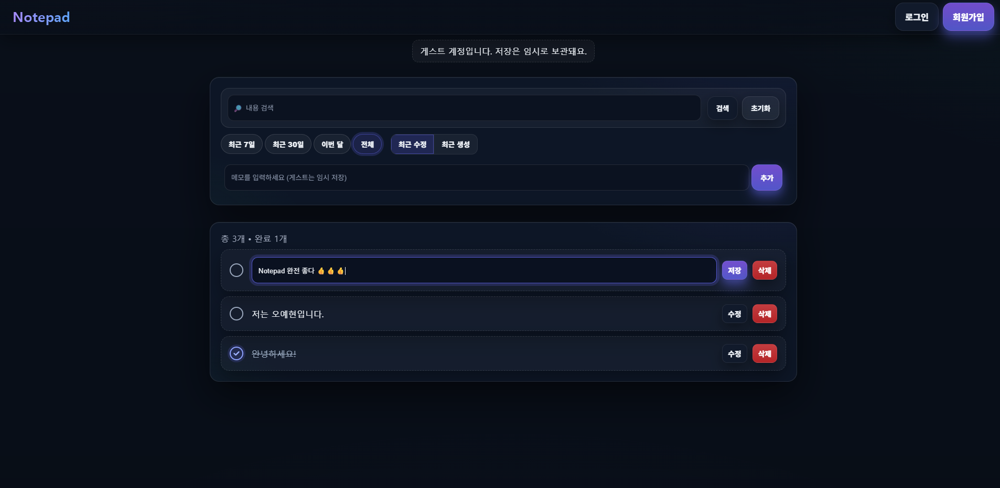
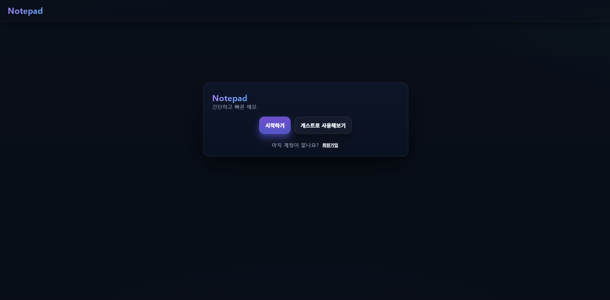
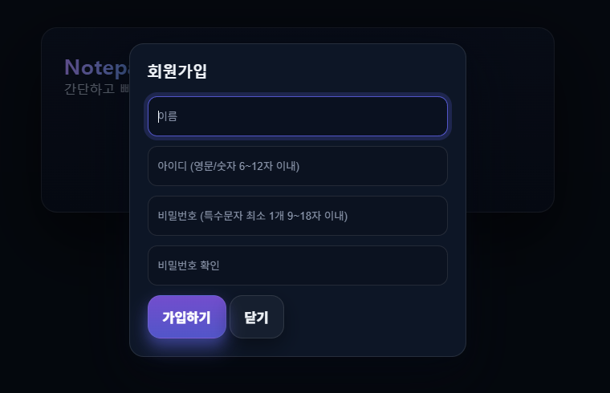

# 📝 나만의 메모장 (Memo Notepad)

`Spring Boot` 기반의 간단한 메모장 웹 서비스입니다.  

**로그인 없이도 메모 작성이 가능**하며,   
로그인 시에는 **나만의 메모를 안전하게 저장하고 관리**할 수 있습니다.

> 🚀 웹 주소: [ https://notepad.today](https://notepad.today/)

---

## 📌 주요 기능

### ✅ 메모 기능
- 메모 작성 / 수정 / 삭제
- 체크 여부 토글 (완료 상태 표시)
- 메모의 작성 및 수정 시간을 자동으로 저장
- 로그인 사용자 / 비로그인 사용자 각각의 메모 분리 관리

### ✅ 인증 및 회원 기능
- 로컬 회원가입 및 로그인
- `OAuth2` 소셜 로그인 (`Google`, `Kakao`)
- `JWT` 기반 인증 및 `Spring Security` 기반 인가
    - `Access Token`(5분 유효) + `Refresh Token`(20분 유효) 기반 인증 구조 구현
    - `Access Token` 만료 시 `Refresh Token`을 통해 재발급
    - `Refresh Token`은 안전하게 `Redis`에 저장되며, 로그아웃 시 삭제 처리
- 게스트 상태로 작성한 메모 → 로그인/회원가입 시 유저 계정으로 이전

### ✅ 비회원(게스트) 기능
- 로그인하지 않아도 `UUID` 기반으로 메모 작성 가능
- 세션 유지 중 자유롭게 메모 작성 및 편집 가능

### ✅ 배포 환경
- `AWS EC2` + `RDS(MySQL)` 기반으로 서비스 운영 중
- `Nginx` 리버스 프록시 + `Blue-Green` 방식 무중단 배포
- `GitHub Actions`로 `CI/CD` 파이프라인을 구성해 빌드 → 테스트 → 배포까지 자동화

---

## 🖥️ 화면 예시

| 메모 목록 화면                                              |  
|-------------------------------------------------------|
|  |

| 메인 화면                                                 |
|-------------------------------------------------------|
|  |

| 로그인 화면                                                            | 회원가입 화면                                                             |
|-------------------------------------------------------------------|---------------------------------------------------------------------|
|  |  |

---

## 🛠 기술 스택!

| 분야              | 기술                                                         |
|-----------------|------------------------------------------------------------|
| Skill           | `Java 21`, `React`, `Vite`, `html5`, `css`                 |
| Framework       | `Spring Boot`, `Spring MVC`, `Spring Security`             |
| DB              | `MySQL`                                                    |
| ORM             | `Spring Data JPA`, `Hibernate`                             |
| Authentication  | `Spring Security`, `JWT(Access + Refresh Token)`, `OAuth2` |
| Cache / Session | `Redis`                                                    |
| Server / Deploy | `Nginx`, `GitHub Actions`                                  |
| Build / Tools   | `Gradle`, `Lombok`                                         |

---

## 📌 추가 예정 기능

- [ ] : 페이징 기능
- [ ] : 고정 기능
- [ ] : 즐겨찾기
- [ ] : 카테고리 별 메모 추가 저장
- [ ] : 사용자 페이지

---

## 👨‍💻 개발자 정보

| 이름        | 	오예현 (`Oh YeHyun`)        |
|-----------|-------------------------|
| 📧 Email	 | ohyhohyl@gmail.com      |
| 📝 Blog	  | https://tyulsjjava.tistory.com |
|  🐙 GitHub	 | https://github.com/OhYeHyun |

---

## 감사합니다! 😄
